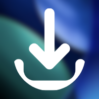

# 🍏 Donverter (macOS Native App)

<p align="center">
  
</p>

<p align="center">
  
  
  
  
</p>

---

**Donverter** adalah aplikasi utilitas lengkap **Native macOS** super premium yang dirancang dengan estetika modern bergaya kaca *(Glassmorphism / Apple Control Center Style)*. Dibangun menggunakan SwiftUI dengan mesin Backend **Python** mandiri (Pillow, FFmpeg, yt-dlp) yang dibundel secara lokal. 

Aplikasi ini menghadirkan pengalaman pengguna yang sangat ringan, responsif, dan menyatu dengan notch fisik macOS Anda.

---

## ✨ Fitur-Fitur Premium

### 🏝️ Dynamic Island-Style Notch Progress Overlay
Terinspirasi dari Dynamic Island Apple, Donverter menyajikan bar progress melayang yang menyatu mulus secara fisik dengan notch MacBook Anda (atau bertindak sebagai pill melayang di monitor non-notch).
* **Posisi Notch Presisi**: Mendeteksi letak safe area monitor untuk menempel tepat di bawah notch fisik Anda tanpa lag ataupun kedipan (anti-flicker).
* **Compact Mode**: Ketika dalam mode resting, hanya menampilkan *Circular Progress Ring* (kiri) dan *Logo App* (kanan) yang sangat minimalis dan bersih.
* **Hover to Expand**: Arahkan kursor mouse ke arah notch untuk memperlebar Dynamic Island menjadi kartu detail berisi persentase unduhan, kecepatan, nama file, dan tombol tindakan.
* **Click to Reveal**: Klik tombol **Show** atau bagian Dynamic Island untuk langsung membuka file hasil unduhan di Finder.

### ⚙️ Jendela Pengaturan Native macOS (`Cmd + ,`)
Akses pengaturan lengkap aplikasi langsung dari bar atas sistem (**Donverter -> Settings...**) atau cukup tekan shortcut standar Mac **`Cmd + ,`**:
* **Enable Toggle**: Nyalakan atau matikan total Dynamic Island. Saat dimatikan, area notch tetap dapat diklik penuh (*click-through*).
* **Display Mode Selector**: Pilih antara **Hover to Expand** (mengembang hanya jika disorot mouse) atau **Always Expanded** (selalu tampil lebar penuh saat aktif).
* **Live Width Extension (Slider + Text Input)**: Geser slider atau masukkan angka px secara manual (40px - 200px) untuk melebarkan/mengecilkan posisi Dynamic Island secara live agar pas dengan notch layar Anda.
* **Custom Background Color Picker**: Ganti warna latar belakang Dynamic Island secara instan menggunakan Color Picker native macOS (mendukung transparansi dan hex kustom).
* **Completion Dismiss Settings**: Pilih untuk menutup Dynamic Island secara otomatis setelah **3s / 5s / 10s / 30s** atau membiarkannya tetap terbuka (**Keep Until Clicked**) sampai Anda mengeklik tombol **Show**.

### 🔄 Background Download Resilience (Singleton Engine)
* Tidak ada lagi download terhenti ketika Anda menutup jendela aplikasi! 
* `DownloadManager` didesain menggunakan arsitektur **Singleton** yang terikat dengan siklus hidup aplikasi utama, bukan jendela tampilan. Jendela utama dapat ditutup bebas, proses download tetap berjalan di background, dan progress-nya akan otomatis tersambung kembali (resume) secara mulus begitu jendela dibuka ulang.

### 📥 Video & Audio Downloader
Mendukung unduhan dengan kualitas tertinggi (hingga 4K) dan output Audio (MP3) untuk platform populer:
* **YouTube**, **TikTok**, & **Instagram**.
* **Smart Auto-Fill**: Cukup buka aplikasi, Donverter akan mendeteksi link media di clipboard Anda secara otomatis dan memasukkannya ke text field.
* **Pintar Mendeteksi Format**: Mengonversi codec secara otomatis menjadi standar H.264 (QuickTime compatible) pada video dari Instagram/TikTok agar bisa langsung diputar di Mac tanpa kendala.

### 🖼️ Batch Image Converter
Lakukan konversi banyak gambar sekaligus (*PNG, JPG, HEIC, WEBP*) ke format target secara instan:
* **Kompresi Cerdas**: Mengurangi ukuran file hingga **50%** dengan tetap mempertahankan kualitas visual yang tinggi.
* **Auto-Zip**: Mengompresi hasil konversi banyak file secara otomatis menjadi satu file `.zip` agar praktis dikelola.

### 🧹 Smart Cleanup Engine
Dapat diakses melalui Menu Bar atas (**Maintenance -> Clear Cache** atau shortcut **`Cmd + Shift + K`**) untuk menghitung ukuran cache sementara dan menghapusnya dalam satu klik guna menghemat kapasitas SSD Mac Anda.

---

## 🛠️ Stack Teknologi
* **Frontend / UI**: SwiftUI (Native Apple Development) + Glassmorphism Theme.
* **Backend / Engine**: Python (`yt-dlp`, `FFmpeg`, `Pillow`).
* **Compiler**: PyInstaller (Freezing Python), `xcodebuild` & `hdiutil` (macOS DMG Image Bundler).

---

## 💿 Distribusi & Instalasi
Donverter mendukung penciptaan *Standalone Disk Image (.DMG)*. Anda tidak membutuhkan Python untuk menjalankan aplikasi ini di komputer lain!
1. File yang dihasilkan akan berupa `DonverterInstaller.dmg`.
2. Cukup buka DMG dan seret aplikasi (Drag and Drop) ke folder **Applications**.
3. 100% Plug-and-Play tanpa instalasi panjang!

---

## 💻 Mengkompilasi Ulang & Membuat DMG
Proyek ini dilengkapi build script otomatis untuk memaketkan ulang aplikasi menjadi `.dmg` installer hanya dalam 1 klik.

Setiap selesai mengubah desain di Xcode atau logika dari file Python (`backend/`), kemas ulang secara otomatis melalui terminal dengan cara mengeksekusi script ini:
```bash
./build_installer.sh
```

Alat otomatisasi tersebut akan mengeksekusi 4 proses secara diam-diam:
1. Membekukan kode `python` menjadi *Binary Executable* (Biner Aplikasi)
2. Memasukkan *Binary* tersebut ke dalam perut `Xcode` *(Bundle Resource)*
3. Melakukan *Compile SwiftUI (Release Mode)*
4. Membungkus menjadi `DonverterInstaller.dmg` ke folder `~/Downloads` Anda!
