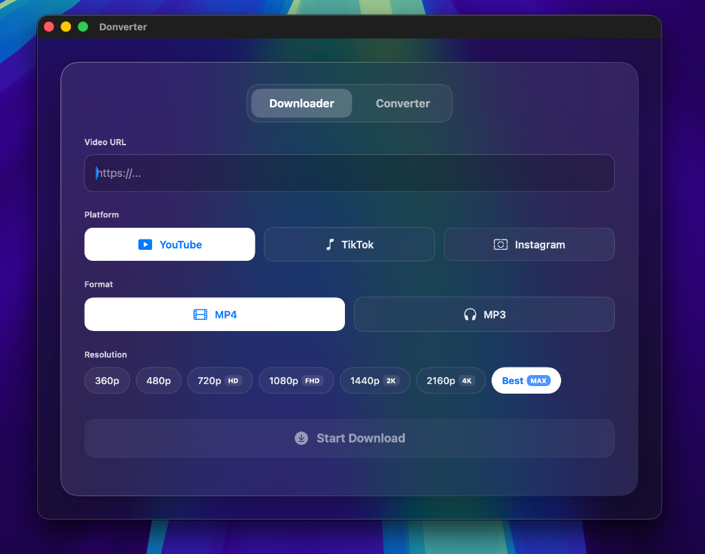

# Donverter (macOS Native App)




Donverter adalah aplikasi utilitas lengkap **Native macOS** yang dirancang dengan antarmuka modern berbahan dasar kaca *(Glassmorphism / Apple Control Center Style)*. Dibangun menggunakan SwiftUI dengan mesin Backend **Python** mandiri, aplikasi ini menghadirkan pengalaman pengguna yang sangat ringan, mulus, dan indah tanpa memakan banyak memori atau membutuhkan instalasi tambahan.

## 🚀 Fitur Utama

- **Video Downloader**: Mendukung unduhan dengan kualitas tertinggi (hingga 4K) dan output Audio Only (MP3) untuk platform populer:
  - YouTube
  - TikTok
  - Instagram
- **Pintar Mendeteksi Format**: Terdapat sistem logika otomatis untuk mengonversi codec menjadi H.264 standar (QuickTime compatible) pada video dari Instagram/TikTok. 
- **Image Converter**: Melakukan Batch Convert (banyak file sekaligus!) dari berbagai jenis format gambar *(PNG, JPG, HEIC, WEBP)* menjadi standar yang Anda tentukan secara instan.
  - Kompresi Cerdas (-50% ukuran file) agar hemat kuota.
  - Unduhan dalam bentuk `.zip` otomatis jika mengonversi banyak file.
- **Ultra-Cepat & Ringan**: UI menggunakan full SwiftUI dengan transisi sekejap (0.15 detik), digabungkan dengan mesin Python (yt-dlp + Pillow) yang hanya aktif 100% ketika tombol ditekan, dan dimatikan secara total sehingga RAM komputer Anda akan kembali kosong.
- **Smart Cleanup Engine**: Tersedia opsi "Clear Cache" (`Cmd + Shift + K`) langsung pada Menu Bar native untuk menghapus ruang penyimpanan sampah/temporary komputer Anda akibat proses konversi.

## 🛠️ Stack Teknologi
- **Frontend / UI**: SwiftUI (Native Apple Development) + Glassmorphism Theme.
- **Backend / Engine**: Python (`yt-dlp`, `FFmpeg`, `Pillow`).
- **Compiler**: PyInstaller (Freezing Python), `xcodebuild` & `hdiutil` (macOS DMG Image Bundler).

## 💿 Distribusi (Install ke Mac Lain)
Donverter mendukung penciptaan *Standalone Disk Image (.DMG)*. Anda tidak membutuhkan Python untuk menjalankan aplikasi ini di komputer lain!
- File yang dihasilkan akan berupa `DonverterInstaller.dmg`.
- Cukup buka DMG dan seret aplikasi (Drag and Drop) ke folder **Applications**.
- 100% Plug-and-Play tanpa instalasi panjang!

## ⚙️ Mengkompilasi Ulang & Membuat DMG Mandiri
Proyek ini sudah dilengkapi alat Otomatisasi (Build Script) sehingga Anda bisa melakukan Modifikasi lalu menjadikannya `.dmg` lagi hanya dalam 1 klik.

Setiap selesai mengubah desain di Xcode atau logika dari file Python (`backend/`), kemas ulang secara otomatis melalui terminal dengan cara mengeksekusi script ini:
```bash
./build_installer.sh
```

Alat ajaib tersebut akan mengeksekusi 4 proses secara diam-diam:
1. Membekukan kode `python` menjadi *Binary Executable* (Biner Aplikasi)
2. Memasukkan *Binary* tersebut ke dalam perut `Xcode` *(Bundle Resource)*
3. Melakukan *Compile SwiftUI (Release Mode)*
4. Membungkus menjadi `DonverterInstaller.dmg` ke folder `~/Downloads` Anda!
