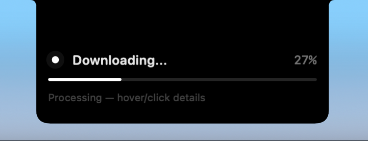
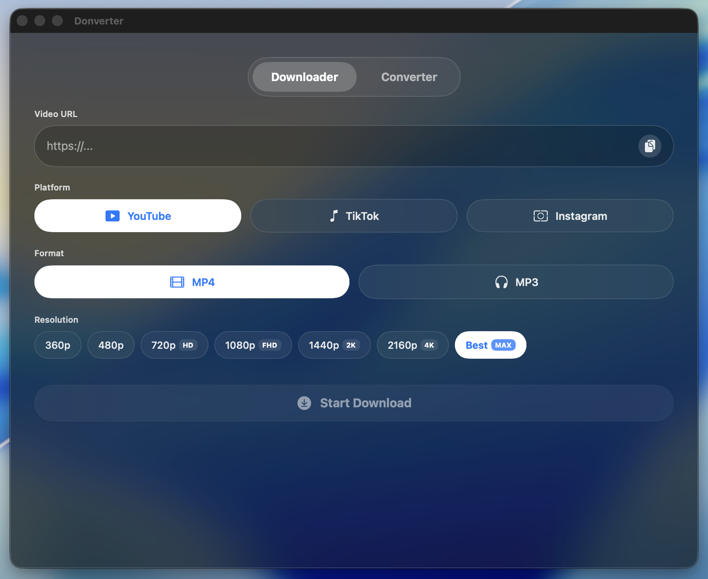
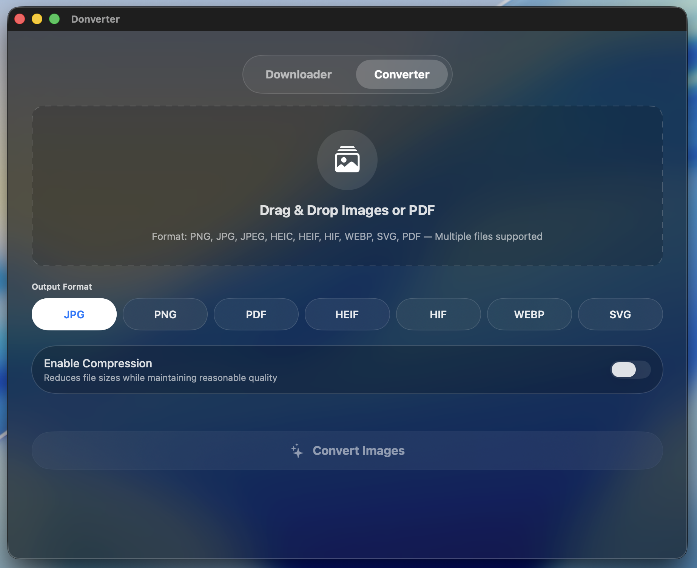

# 🍏 Donverter (macOS Native App)

<p align="center">
  
</p>

<p align="center">
  
  
  
  
</p>

---

**Donverter** is a premium, complete, **Native macOS** utility application designed with a modern glassmorphic aesthetic *(Glassmorphism / Apple Control Center Style)*. It is built using SwiftUI with a self-contained local **Python** backend engine (Pillow, FFmpeg, yt-dlp) bundled directly inside the app.

This application delivers a highly lightweight, responsive, and seamless user experience that integrates physically with your macOS notch.

---

## 📥 Download

[](https://github.com/bryandanendra/Donverter-MacNative/releases/latest/download/DonverterInstaller.dmg)

You can download the latest pre-compiled macOS installer directly from the link above or visit the [Releases page](https://github.com/bryandanendra/Donverter-MacNative/releases).

> [!NOTE]
> Since this application is ad-hoc signed, macOS Gatekeeper might block it on first launch. To run it:
> 1. Double-click the downloaded `.dmg` and drag **Donverter** to your **Applications** folder.
> 2. Open **Applications**, right-click **Donverter.app**, and select **Open**.
> 3. Click **Open** on the confirmation dialog. (Or go to **System Settings > Privacy & Security** and select **Open Anyway**). This is only required once.

---

## ✨ Premium Features

### 🏝️ Dynamic Island-Style Notch Progress Overlay
Inspired by Apple's Dynamic Island, Donverter features a floating progress bar that integrates seamlessly with your MacBook's notch (or acts as a floating pill on non-notch monitors).
* **Precise Notch Positioning**: Automatically detects the screen's safe area to attach perfectly beneath your physical notch with no lag or flicker (anti-flicker).
* **Compact Mode**: When resting, it displays a minimal and clean design containing only a *Circular Progress Ring* (left) and the *App Logo* (right).
* **Hover to Expand**: Hover your mouse cursor over the notch to expand the Dynamic Island into a detailed card showing download percentage, speed, filename, and action buttons.
* **Click to Reveal**: Click the **Show** button or click on the Dynamic Island itself to open the downloaded file directly in Finder.

<p align="center">
  
  &nbsp;
  
</p>

### ⚙️ Native macOS Settings Window (`Cmd + ,`)
Access comprehensive application settings directly from the system menu bar (**Donverter -> Settings...**) or simply by pressing the standard Mac shortcut **`Cmd + ,`**:
* **Enable Toggle**: Enable or fully disable the Dynamic Island. When disabled, the notch area is completely click-through.
* **Display Mode Selector**: Choose between **Hover to Expand** (expands only when hovered by the mouse) or **Always Expanded** (always shows the full width when active).
* **Live Width Extension (Slider + Text Input)**: Adjust the slider or manually input the width in pixels (40px - 200px) to resize the Dynamic Island in real-time to fit your screen's notch perfectly.
* **Custom Background Color Picker**: Instantly change the Dynamic Island's background color using the native macOS Color Picker (supports transparency and custom hex codes).
* **Completion Dismiss Settings**: Choose to automatically close the Dynamic Island after **3s / 5s / 10s / 30s** or keep it open (**Keep Until Clicked**) until you click the **Show** button.

### 🔄 Background Download Resilience (Singleton Engine)
* No more interrupted downloads when you close the application window!
* The `DownloadManager` is designed using a **Singleton** architecture tied to the lifecycle of the main application, not the UI window. The main window can be closed freely; the download process will continue running in the background, and its progress will automatically and seamlessly reconnect (resume) once the window is reopened.

### 📥 Video & Audio Downloader
Supports downloading with the highest quality (up to 4K) and Audio (MP3) output for popular platforms:
* **YouTube**, **TikTok**, & **Instagram**.
* **Smart Auto-Fill**: Simply open the app, and Donverter will automatically detect media links in your clipboard and paste them into the text field.
* **Smart Format Detection**: Automatically converts video codecs to standard H.264 (QuickTime compatible) for videos from Instagram/TikTok, ensuring they can be played on macOS without issues.

<p align="center">
  
</p>

### 🖼️ Batch Image Converter
Convert multiple images (*PNG, JPG, HEIC, WEBP*) to your target format simultaneously:
* **Smart Compression**: Reduces file size by up to **50%** while maintaining high visual quality.
* **Auto-Zip**: Automatically compresses multiple converted files into a single `.zip` file for easier organization.

<p align="center">
  
</p>

### 🧹 Smart Cleanup Engine
Accessible via the top Menu Bar (**Maintenance -> Clear Cache** or shortcut **`Cmd + Shift + K`**) to calculate temporary cache size and clear it in one click to save SSD space on your Mac.

---

## 🛠️ Tech Stack
* **Frontend / UI**: SwiftUI (Native Apple Development) + Glassmorphism Theme.
* **Backend / Engine**: Python (`yt-dlp`, `FFmpeg`, `Pillow`).
* **Compiler**: PyInstaller (Freezing Python), `xcodebuild` & `hdiutil` (macOS DMG Image Bundler).

---

## 💿 Distribution & Installation
Donverter supports building a *Standalone Disk Image (.DMG)*. You do not need Python installed on your system to run this app on another computer!
1. The built file will be outputted as `DonverterInstaller.dmg`.
2. Simply open the DMG and drag-and-drop the application into the **Applications** folder.
3. 100% Plug-and-Play with no complicated setup!

---

## 💻 Recompiling & Creating DMG
The project features an automated build script to package the app into a `.dmg` installer in just one click.

Whenever you update the design in Xcode or edit the logic in the Python files (`backend/`), repackage the app via terminal by running:
```bash
./build_installer.sh
```

This automation script handles 4 steps under the hood:
1. Freezes the `python` code into a *Binary Executable*.
2. Copies that *Binary* into the `Xcode` project as a *Bundle Resource*.
3. Performs a *SwiftUI Compile (Release Mode)*.
4. Packages everything into `DonverterInstaller.dmg` and saves it to your `~/Downloads` directory!
